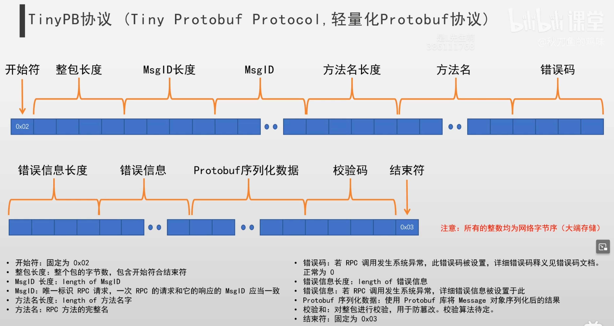

# 自定义协议格式(TInyPB协议)

## 1 为什么要自定义协议格式
既然用了 Protobuf 做序列化,为什么不直接把序列化后的结果直接发送,而要在上面再自定义一些字段?

1. 为了方便分割请求:因为 portobuf 后的结果是一串无法辨别的字节流,无法区分哪里是开始或者结束,比如说吧两个 Message 对象序列化后的结果排在一起,甚至无法分开这两个请求,在 TCP 传输是按照字节流传输,没有包的概念,因此应用层更无法区分了  
2. 为了定位:加上 MsgID 等信息,能帮助我们匹配一次 RPC 请求和响应,不会串包
3. 错误方便查错误: 加上错误信息,能很容易知道 RPC 失败的原因,方便 问题定位

## 2 协议信息

# 2 Protobuf
## 2.1 RPC 服务端流程
注册 OrderService 对象

1. 从 buffer 中读取数据,然后 decode 得到请求的 TinyPBProtobcol 对象,  
   然后从请求的 TinyPBProtocol 得到 method_name, 从 OrderService 对象
   里根据 service.method_name 找到方法 func
2. 找到对应的 request type 以及 response type
3. 将请求体 TinyPBProtocol 里面的 pb_data 反序列化为 request type 的
   一个对象,生命一个空的 response type 对象
4. 执行方法 func(request, response)
5. 将 response 对象序列为 pb_data,再放到 TinyPBProtocol 结构体中,对其
   做 encode,转换为二进制字节流, 然后放入 buffer 里面. 注册可写事件监听,
   就会发送回包了
